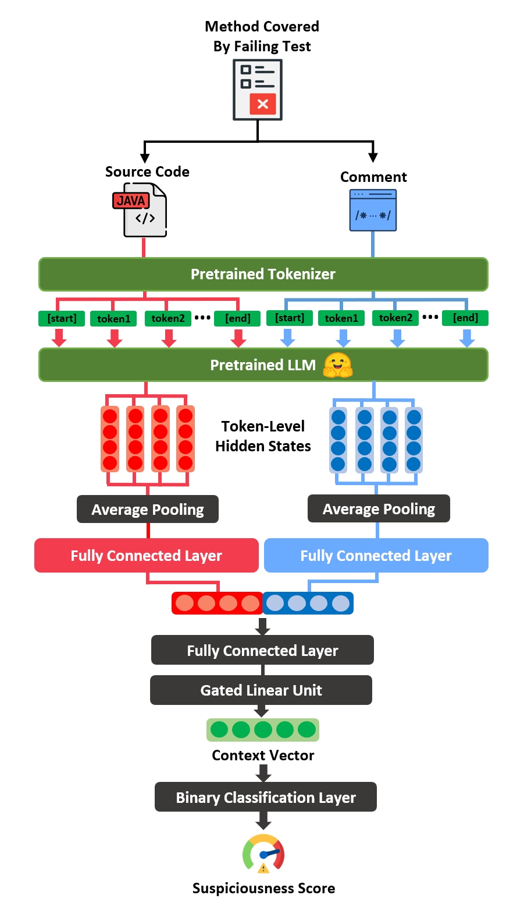

# LiteFL: Lightweight LLM-Based Fault Localization

This project provides a fault localization framework using lightweight large language models (LLMs). It performs method-level fault localization on Defects4J using source code and comment embeddings.



---

## 🚀 Getting Started

Follow the steps below to preprocess the data and run within-project and cross-project fault localization experiments.

---

### ✅ Step 1: Data Preprocessing 

For each buggy version in the `defects4j/` folder, the source code and comments of covered methods are embedded using an LLM. The resulting embeddings are stored in the `chunks/` directory.

```bash
python generate_embeddings_batch.py
```

---

### ✅ Step 2: Split Chunks

Splits the all.pkl file saved in the chunks/ directory into separate files by project.

```bash
python split_projects.py
```
---

### ✅ Step 3:  Within-Project

For each project, performs training and validation using a leave-one-out strategy.
The results are saved in results/experiments.txt.

```bash
./leave_one_out_project.sh
```

---

### ✅ Step 4: Cross-Project
 
Uses one project as the test set and the remaining projects as the training set.
The results are saved in cross_results/experiments.txt.

```bash
./cross_project.sh
```
